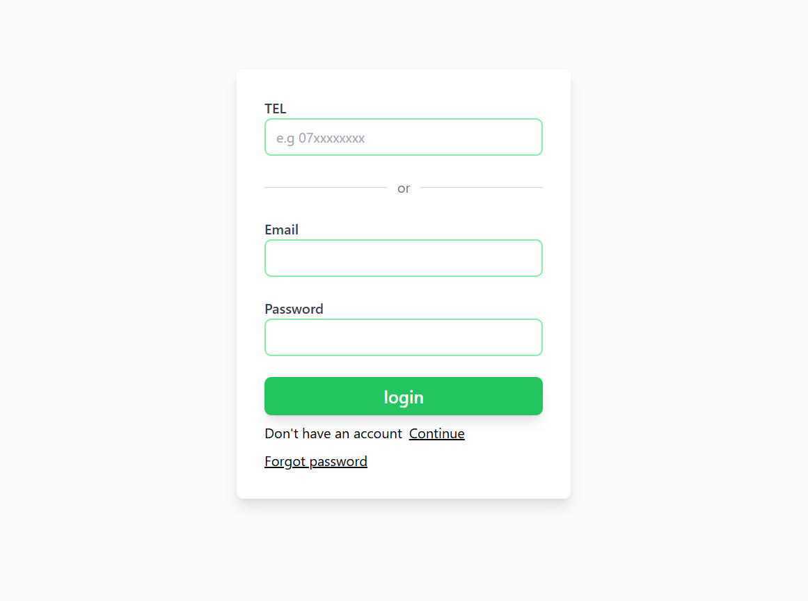
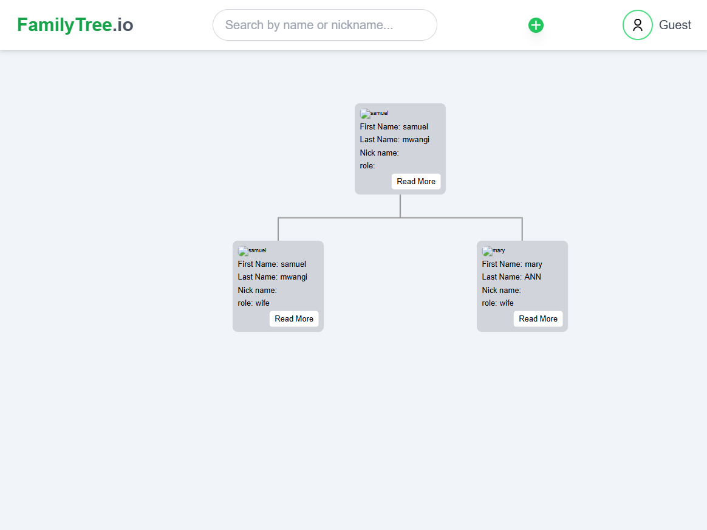
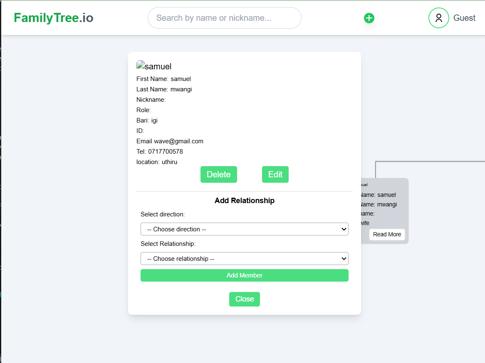
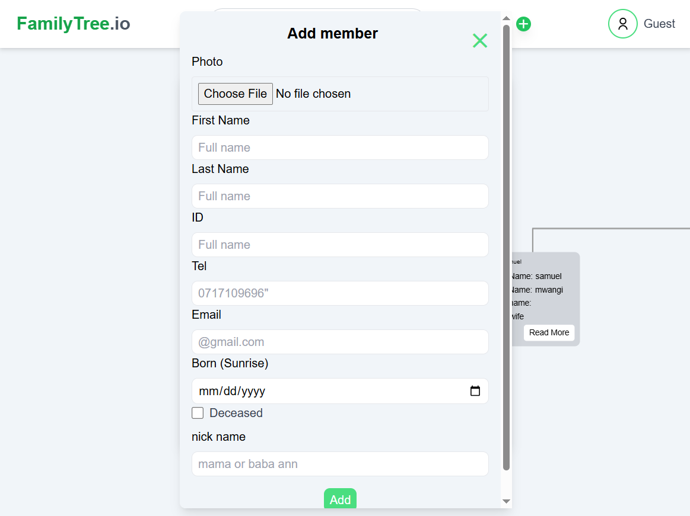
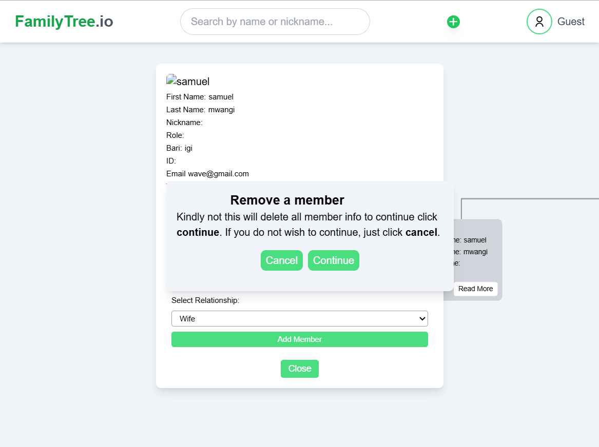
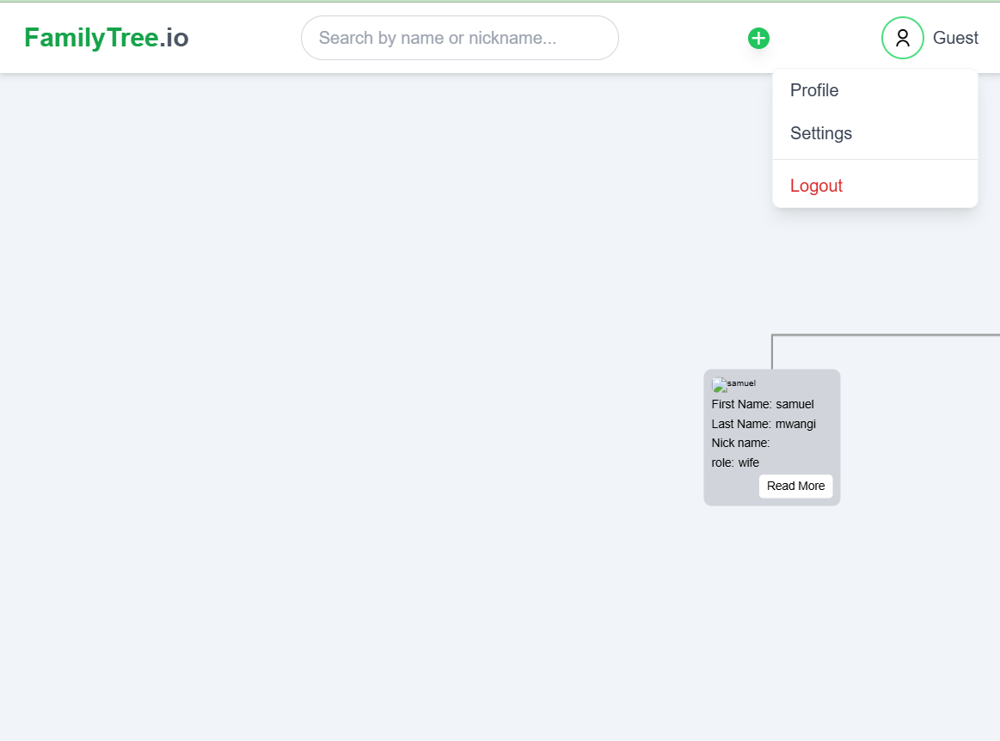
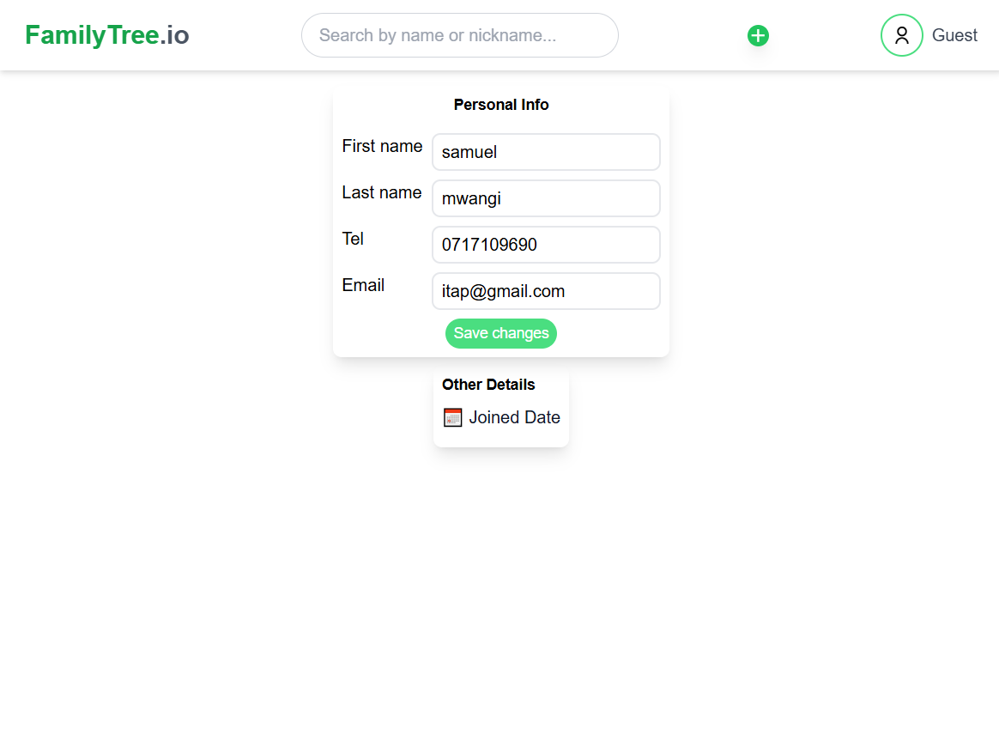

# Famiy Tree project
NB:// this project can only fit one family tree if more than one it will overlap, Any improvement will be heighly apreciated
# Languages Used PHP + JS +TAILWIND CSS + MYSQL
#Features
-Login page for user/admin
-User view of family tree after login
-Admin add new family tree with its members-Admin edit/ remove a family member
-Guest login for New admin with profile update(Personal details And Password Update)
-Password reset for both admin and user(OTP verification to reset password email based Phone number based not yet upated)
## for guest logi after clicking Continue on login page to save data create on family tree admin will have to update the profile data and password to enable  future login and view of saved data

#Screenshots
###  Login Page

###  Family Tree Page

### addMemberfirstSelecton

### addMemberfinallForm

### removeMember

### editMemberInfo

### accessToProfileAndSettings

### userProfile

### userSettings

### future updates
-search family member by name, email,tel or nickmae
-add OTP assword reset via Phone number
-Delete/deactivate admin account
-Add notification preferences(email/sms)
## challanges
integrating the  tree js liblary from zoomin i/out/ displaying user data in nodes, connecting nodes
if a user logs in if they are a member to a certain family tree that tree will load, it a gust tree 
will be blank and if user wants to add tree they will be prompted to update there profile data or just
continue without updating there data
# to solve login issues for guest and others we will make give one user previlages to edit /create the tree
this user maybe the first person to create the trea  first in guest mode so we will add data for the user in
the members table without a tree to link them but an id o link them to the tre as admin then the users will be 
able to login  with there credentials without previlages for edit and ad tree they can only view
# you can only add one tree more than one tree will overlap
#adding user to login and view only but admin can edit/add